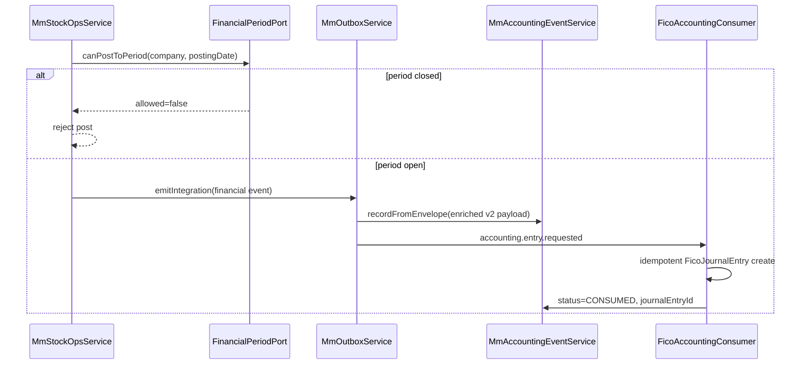

# MM ↔ FICO Integration (Phase 3D)

Formal accounting event contract between **Materials Management (MM)** and **Financial Accounting (FICO)**.

Related: [MM_INTEGRATION_CONTRACTS.md](./MM_INTEGRATION_CONTRACTS.md) · [MM_INTEGRATION_EVENTS.md](./MM_INTEGRATION_EVENTS.md)

---

## Ownership

| Domain | Owns |
| --- | --- |
| MM | Physical inventory, valuation amounts, accounting **event** generation |
| FICO | GL, AP, AR, payments, fiscal periods, account determination, journal entries |

MM **never** posts GL entries or hardcodes account numbers. MM sends semantic **accounting effect hints** plus account-determination context; FICO resolves final accounts.

---

## Event flow



---

## Accounting effect hints (not GL accounts)

| Hint | Typical MM trigger |
| --- | --- |
| `INVENTORY_INCREASE` | Goods receipt |
| `GRIR_ACCRUAL` | Goods receipt (procurement) |
| `INVENTORY_DECREASE` | Goods issue, supplier return |
| `COGS_EXPENSE` | Goods issue |
| `INVENTORY_LOSS` | Scrap / disposal |
| `INVENTORY_ADJUSTMENT` | Inventory adjustment |
| `GRIR_REVERSAL` | Supplier return |
| `TRANSFER_CLEARING` | Inter-warehouse transfer (when financially relevant) |
| `INVENTORY_REVALUATION` | Standard cost / valuation change |
| `LANDED_COST` | Landed cost allocation |
| `PRICE_VARIANCE` | PO/invoice price variance |
| `REVERSAL` | Document reversals |

---

## v2 payload schema (`MmAccountingEventPayloadV2`)

Required context for FICO account determination:

- `companyId`, `plantId`, `postingDate`, `transactionDate`, `currencyCode`
- `documentType`, `documentId`, `sourceModule`
- `accountingEffects[]` — semantic hints only
- `lines[]` — per line: `materialId`, `materialTypeId/Code`, `valuationClassId/Code`, `movementType`, `quantity`, `unitCost`, `totalCost`, optional `costCenterId`, `warehouseId`, `plantId`
- `financiallyRelevant: boolean`

Idempotency fields:

- `sourceEventId` — outbox `eventId`
- `sourceTransactionId` — inventory/valuation txn id when applicable
- `idempotencyKey` — unique consumer dedupe key (`eventType:documentType:documentId[:suffix]`)

Persistence: `MmAccountingEvent` (`status: PENDING | CONSUMED | FAILED`).

Legacy alias: in-process bus event `accounting.entry.requested`.

---

## Period control

MM calls FICO port only — **MM does not store fiscal periods**.

```typescript
canPostToPeriod({ companyId, postingDate }) → { allowed, periodKey?, reason? }
```

Port: `FINANCIAL_PERIOD_PORT` · Implementation: `FicoFinancialPeriodService` · Guard: `MmPostingPeriodGuard`.

FICO tables: `fico_financial_periods` (`OPEN` | `CLOSED`).

---

## FICO consumer (minimal stub)

| Component | Path |
| --- | --- |
| Consumer | `backend/src/fico/fico-accounting-consumer.service.ts` |
| Journal stub | `backend/src/fico/fico-journal.service.ts` |
| Period service | `backend/src/fico/financial-period.service.ts` |
| Reconciliation | `backend/src/fico/fico-reconciliation.service.ts` |

Journal entries keyed on `idempotencyKey` — duplicate delivery creates no second entry.

---

## Reconciliation

Compare MM inventory valuation (`MmMaterialValuation.totalValue`) vs FICO posted journal totals (`FicoJournalEntry.totalAmount`) for the same company/material/date scope.

| Endpoint | Purpose |
| --- | --- |
| `GET /api/v1/fico/reconciliation` | FICO admin report |
| `GET /api/v1/mm/integration/fico/reconciliation` | MM-facing integration read API |

Rows return `mmValue`, `ficoValue`, `difference`, `status` (`MATCH` | `VARIANCE`).

---

## Supported financial events

| Event | MM source |
| --- | --- |
| `GoodsReceiptPosted` / `GoodsReceiptReversed` | Goods receipt service |
| `GoodsIssuePosted` / `GoodsIssueReversed` | Goods issue service |
| `InventoryAdjusted` | Adjustment service |
| `InventoryTransferred` | Warehouse transfer / WM transfer |
| `SupplierReturnPosted` / `SupplierReturnReversed` | Supplier return service |
| `DisposalPosted` / `ScrapPosted` / `DisposalReversed` | Disposal service |
| `InventoryValuationUpdated` / `InventoryRevaluationPosted` | Valuation engine |
| `LandedCostAllocated` | Valuation engine (landed cost) |
| `PriceVariancePosted` | Valuation engine / three-way match bridge |

Implementation: `backend/src/mm/common/mm-accounting-event.service.ts`, `backend/src/mm/integration/fico/`.
