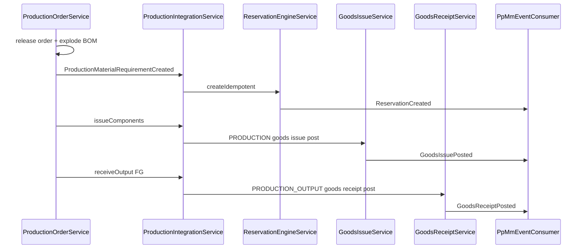

# MM ↔ Production Integration (Phase 3C)

Formal integration contract between **Production (PP)** and **Materials Management (MM)** for component reservation, allocation, goods issue, and finished-goods receipt.

Related: [MM_INTEGRATION_CONTRACTS.md](./MM_INTEGRATION_CONTRACTS.md) · [MM_INTEGRATION_EVENTS.md](./MM_INTEGRATION_EVENTS.md)

---

## Ownership

| Domain | Owns |
| --- | --- |
| Production | BOM master, production orders, material requirements, output reporting |
| MM | Inventory balances, ATP, reservations, allocations, picking, goods issue/receipt, ledger |

Production **must not** write `MmInventoryBalance` or reservation tables directly. MM MRP reads BOM via `BomProvider` — **no duplicate BOM master in MM**.

---

## Integration API

Base path: **`/api/v1/mm/integration/production`**

| Method | Path | Purpose |
| --- | --- | --- |
| POST | `/availability/check` | Single-material ATP |
| POST | `/availability/check-batch` | Multi-component check before release |
| POST | `/availability/check-date` | ATP with required date metadata |
| POST | `/reservations` | Idempotent multi-line reserve from production order |
| POST | `/reservations/by-source/:productionOrderId/release` | Release all reservations on cancel |
| POST | `/reservations/by-source/:productionOrderId/adjust` | Partial release on component qty decrease |
| GET | `/reservations/by-source/:productionOrderId/status` | Reservation/allocation snapshot |
| POST | `/components/issue` | Allocate + goods issue for reserved components |
| POST | `/output/receive` | Create + post GR for finished goods output |

Implementation: `backend/src/mm/integration/production/`

---

## Material flow

---

## Events

### Production produces → MM consumes

| Event | MM action |
| --- | --- |
| `ProductionOrderReleased` | ATP batch check |
| `ProductionMaterialRequirementCreated` | Idempotent multi-line reserve |
| `ProductionOrderCancelled` | `releaseBySourceDocument()` |
| `ProductionMaterialRequirementChanged` | `adjustBySourceDocument()` |

Consumer id: `MM_PP_DEMAND`

### MM produces → Production consumes

| Event | Production action |
| --- | --- |
| `ReservationCreated` | Update component `reservedQuantity`, `integrationStatus` |
| `ReservationReleased` | Clear or reduce reserved qty |
| `ShortageDetected` | Set component `integrationStatus=SHORT` |
| `AllocationCreated` | Warehouse visibility |
| `GoodsIssuePosted` | Update `issuedQuantity` on components |
| `GoodsReceiptPosted` | Link output to GR, mark order `COMPLETED` when done |

Consumer id: `PP_FULFILLMENT`

---

## BOM

Production owns `PpBillOfMaterial` / `PpBomComponent`. MM consumes via `ProductionBomProvider` implementing [`BomProvider`](backend/src/mm/planning/bom-provider.ts). MRP BOM explosion uses the same port — no BOM tables in MM schema.

---

## Cancellation and quantity guards

- PP `cancel()` sets status `CANCELLED` before emitting event
- MM `releaseBySourceDocument()` cancels active headers — no hard delete
- Re-reserve on cancelled order → rejected via `ProductionOrderGuardAdapter`
- Component qty decrease → partial release; reject if new qty < issued qty
- Duplicate reserve → idempotency key returns existing header

---

## Tests

`backend/src/mm/integration/production/pp-mm-integration.spec.ts` — multi-component reserve (RM-001/RM-002), cancel, qty change, cancelled guard, FG output receipt.
