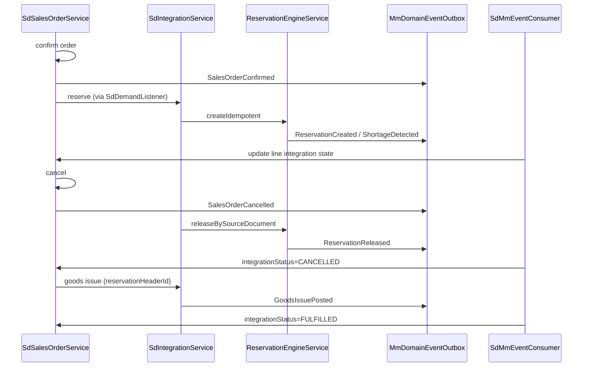

# MM ↔ SD Integration (Phase 3B)

Formal integration contract between **Sales & Distribution (SD)** and **Materials Management (MM)** for ATP, reservation, cancellation, quantity changes, and goods issue fulfillment.

Related: [MM_INTEGRATION_CONTRACTS.md](./MM_INTEGRATION_CONTRACTS.md) · [MM_INTEGRATION_EVENTS.md](./MM_INTEGRATION_EVENTS.md)

---

## Ownership

| Domain | Owns |
| --- | --- |
| SD | Sales orders, customer demand, shipment documents, integration state on `SdSalesOrderLine` |
| MM | Inventory balances, ATP, reservations, allocations, picking, goods issue, ledger |

SD **must not** write `MmInventoryBalance` or reservation tables directly. All stock operations go through the MM integration API.

---

## Integration API

Base path: **`/api/v1/mm/integration/sd`**

| Method | Path | Purpose |
| --- | --- | --- |
| POST | `/availability/check` | Single-material ATP |
| POST | `/availability/check-batch` | Multi-line cart check (SO confirm) |
| POST | `/availability/check-date` | ATP with required date metadata |
| POST | `/reservations` | Idempotent reserve from SD demand reference |
| POST | `/reservations/by-source/:sourceDocumentId/release` | Release all active reservations for SO |
| POST | `/reservations/by-source/:sourceDocumentId/adjust` | Partial release on qty decrease |
| GET | `/reservations/by-source/:sourceDocumentId/status` | Reservation/allocation snapshot |

Implementation: `backend/src/mm/integration/sd/`

---

## Event flow

### SD produces (MM consumes)

| Event | MM action |
| --- | --- |
| `SalesOrderConfirmed` | ATP batch check → idempotent reserve |
| `SalesOrderCancelled` | `releaseBySourceDocument()` |
| `SalesDemandChanged` | `adjustBySourceDocument()` per changed line |

Consumer: `MmEventConsumerService` with `consumerId: MM_SD_DEMAND` (`sd-demand.listener.ts`).

### MM produces (SD consumes)

| Event | SD action |
| --- | --- |
| `ReservationCreated` | Set `reservationHeaderId`, `reservedQuantity`, `integrationStatus` |
| `ReservationReleased` | Clear or reduce reservation; mark `CANCELLED` on full release |
| `ShortageDetected` | Set line `integrationStatus=SHORT` |
| `AllocationCreated` / `AllocationReleased` | Warehouse visibility (future SD UI) |
| `GoodsIssuePosted` | Increment `issuedQuantity`; `FULFILLED` when complete |

Consumer: `SdMmEventConsumer` (`consumerId: SD_FULFILLMENT`).

---

## Cancellation rules

1. SD `cancel()` sets order status `CANCELLED` **before** emitting `SalesOrderCancelled`.
2. MM `releaseBySourceDocument()` calls `cancel()` on each active header — releases warehouse qty, sets status `CANCELLED`/`RELEASED`. **No hard delete.**
3. Re-reserve on cancelled order → `400 Sales order cancelled or not active`.

---

## Quantity validation guards

| Risk | Guard |
| --- | --- |
| Duplicate demand | Idempotency key + unique active reservation per source document |
| Duplicate reservation | `createIdempotent()` returns existing header |
| Cancelled order | `SdOrderGuardAdapter` + SD status check |
| Qty decrease below issued | Rejected in `adjustLineQuantityBySource()` |
| Insufficient stock | ATP before confirm; `ShortageDetected` when partial reservation |

---

## Goods issue linkage

Sales fulfillment GI must include:

- `issuePurpose: SALES`
- `sourceDocumentType: SALES_ORDER`
- `sourceDocumentId`: sales order id
- `reservationHeaderId`: active reservation header

On post, `GoodsIssuePosted` includes `documentReferences` (SO, reservation, GI, inventory transactions) and SD line mapping via `demandReferenceLineId`.

---

## SD backend (minimal Phase 3B)

| Model | Purpose |
| --- | --- |
| `SdSalesOrder` | Header with `DRAFT \| CONFIRMED \| CANCELLED` |
| `SdSalesOrderLine` | Demand qty, reserved/issued qty, `integrationStatus` |
| `SdShipment` | Lightweight shipment stub |
| `SdEventOutbox` | SD domain event outbox |

Module: `backend/src/sd/`

---

## Tests

`backend/src/mm/integration/sd/sd-mm-integration.spec.ts` — cancel, qty change, idempotent reserve, cancelled guard, status snapshot.
